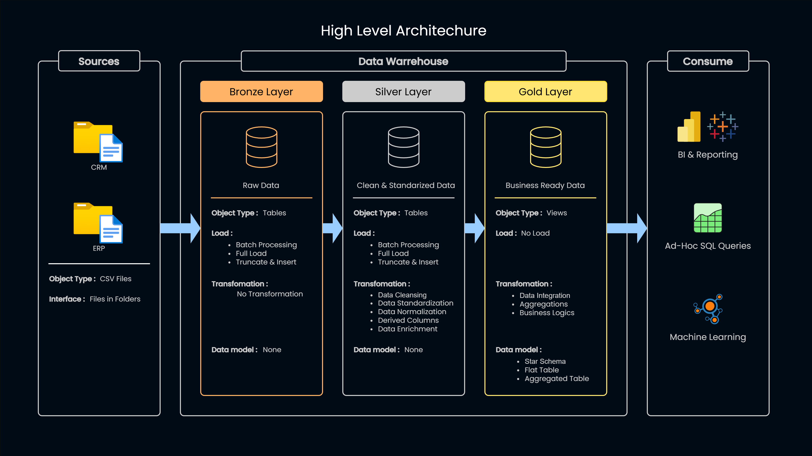
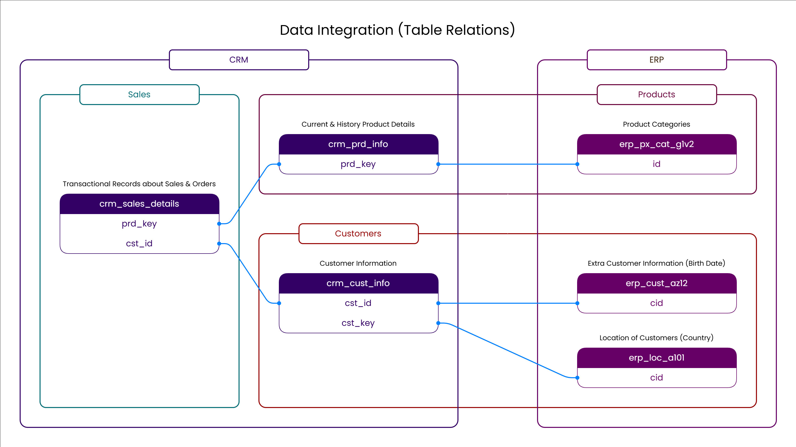
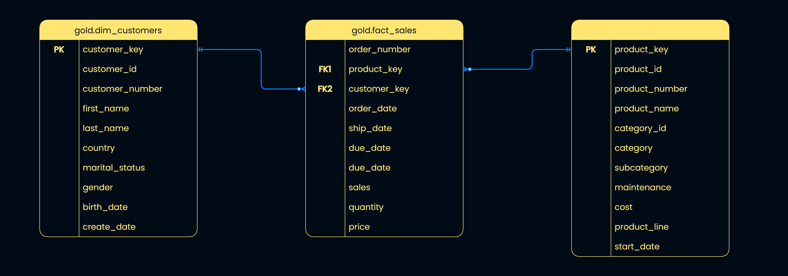
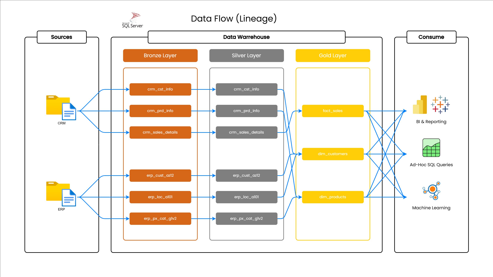

# Retail Data Warehouse : ETL Medallion Pipeline

Welcome to the Retail Data Warehouse Project 🪛  
This is a comprehensive SQL **Data Warehouse Project** consisting of an end-to-end **ETL Pipeline** implemented through the **Medallion Architecture.**

## 🚀 Project Overview
The goal of this project is to take unorganized data from a retail chain spanning across different countries, put them through a full ETL pipeline and produce clean and business ready data for analysis and reporting.  
This main concepts of this project are
- **ETL Pipeline :** Extracting, Transforming and Loading data from th source into the Data Warehouse
  
- **Medallion Architecture :** Designing the Architecture based on the Medallion Structure (**Bronze**, **Silver** and **Gold** layers)
  
- **Data Modelling :** Developing **Fact** and **Dimension** tables using **Star Schema** for Analysis and Reporting purposes

## 🛠 Data Architecture
The Data architecture of this project is based on the **Medallion Structure**, that is the data flows through three layers **Bronze** , **Silver** and **Gold**  

**Bronze Layer :** Data is extracted from the source as it is. The files are stored into the Warehouse

**Silver Layer :** Data is extracted from the Bronze layer as it is. Further manipulating the raw data by cleaning, standardizing, normalizing

**Gold Layer :** Data is not extracted, but only access to data that has been combined and organised from the Silver layer is provided

## 💡 Project Pipeline
### Source
The source file for this project consisted of two major groups of data tables, each with three  
tables inside of them regrading details about **Customers** , **Products** and **Sales**
1. **Customer Relationship Managment (CRM)**

    - Basic Customer information `crm_cust_info`
      
    - Basic Product information `crm_prd_info`
      
    - Basic Sales information `crm_sales_details`

2. **Enterprise Resource Planning (ERP)**

    - Additonal Customer Demographics information `erp_cust_az12`
      
    - Additional Customer Geographic information `erp_loc_a101`
      
    - Additional Product Category information `erp_px_cat_g1v2`

### Data Warehouse
The Medallion structure was selected for this particular project in order to establish a strict seperation of cencerns. 
The entire Extract, Transform and Load processes for this project was implemented multiple times through out the these three
layer according to the pre defined actions that should be taken inside each layer

- **Bronze Layer**
  - Data is loaded into the Bronze layer directly from the CSV source file
  
  - Data is not transformed in any capacity

- **Silver Layer**
  - Data is loaded into the Silver layer directly from the Bronze layer

  - Data is manupulated by **Cleaning** , **Standardizing** and **Normalizing** each column

  - Data **Enrichment** is also done through **Derived Columns**
 
  - Data **Realationship** between columns are established

- **Gold Layer**
  - No data is loaded into the Gold layer as tables

  - **Views** are created as **Dimension** and **Fact** tables by combing existing tables in the Silver layer

  - Data transformation includes **Integraton**, **Aggregations** and **Business Logics**

  - The **Fact** and **Dimension** tabels are modelled to form a **Star Schema** structure to the data

### Business Ready Data
After processing data through three layer the end data is user friendly and ready for business actions
The Medallion structure provides an outcome that can be used for consumption by Analysts ans Non-Technical users accordingly

### Documentation
Additonal documentation includes **Data Catalog** with further breakdown of each tables and their columns of the final tables
along with detailed documentation regarding the **Naming Conventions** used throughout the process for naming various objects

- [Data Catalog](docs/data_catalog.md)

- [Naming Conventions](docs/naming_conventions.md)

## 🚀 Project Reqirements
Build an End-To-End Data Warehouse to convert raw data from retail store accross different countries into actionable insights. 
The initial data is stores in the source as group of CSV files within two eintites regarding Customer Relationship Management (CRM)
and Enterprise Resource Planning (ERP). Procide clear documentation for every step of the process to be shared with Analysts and
Stakeholders for further use cases.

### **Specifications**

- [x] **Source :** Import data from two sources, CRM and ERP into Data Warehouse

- [x] **Quality :** Clean, Standardize and Normalize the data for futher processes

- [x] **Integration :** Cobime and Connect the various elements in the data to form a analysis ready model

- [x] **Documentation :** Provide all the necessary documentation require for Analyst and other Non-Technical users

## 📈 Business Questions And Insights
With the final layer complete, Stakeholders and Analyst can enquire any questions regarding Products, Customers and Sales for Reporting and Business Optimization

Some important questions may include :
- **What are the 5 top selling products across various categories ?**
  - A query connecting the **Sales** and **Products** tables by aggregating and sorting them based on category  
    and total sales can provide an answer
    
- **Which customers has the highest purchasing history to be included in the an appreciation program ?**
  - Connecting the the **Sales** and **Customers** tables will provide a detailed overview of the order  
    details by each customer
    
- **Are their any correlation between geograhical area and product categories ?**
  - Geogaphical details are provided in the **Customers table and can be connected with the **Products**  
    table to fetch category by location details
    
- What is the overall performance of a retail stores ?
  - A broad enough query with multiple connections across all three tables can provide all the necessary  
    details about a the business performance

##  🔍 How To Run
The entire project was done using **Microsoft SQL Server**, The **SQL** and **T-SQL** Syntax  
used for all the scripts are written in accordance with MS SQL Server compatability.  
It recomended to use MS SQL Server for running the scripts provided in this repository

### Step by Step guide
1. The source dataset is provided in the datasets folder as [`source_crm`](dataset/source_crm) and [`source_erp`](dataset/source_erp)

2. The `init_database` query will create a brand new databse called **RetailDWH** along with  
all the necessary schemas **bronze** , **silver** and **gold** within the databse

3. The `ddl_bronze` qurey followed by `proc_load_bronze` for creating bronze tables and loading data

4. The `ddl_silver` query followed by `proc_load_silver` for creating silver tables and loading data

5. The `proc_load_gold` query for creating fact and dimension tables(views) in the gold layer

6. All the queries follow Truncate and Insert method, Caution when executing these queries as  
   the erase the object with the same name before creating or loading the objects

8. Test queries for each procedure is provided in the test folder for sanity check

